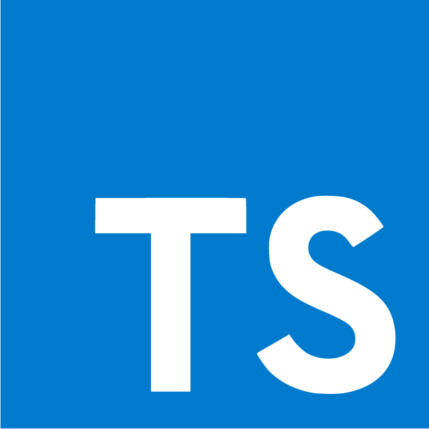
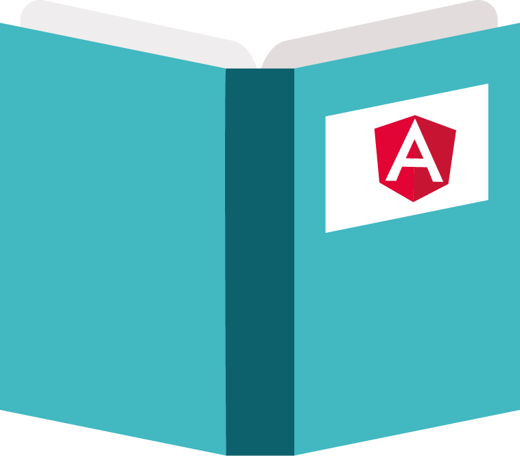
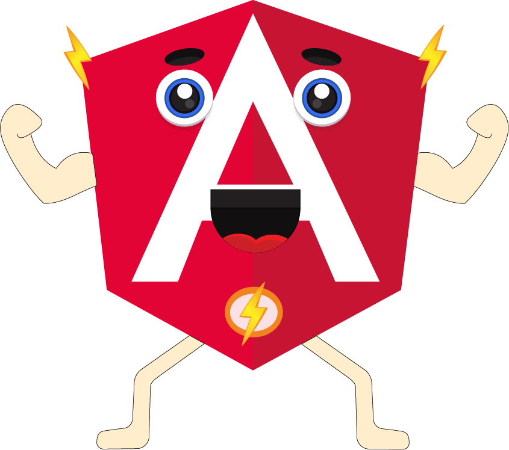

# 🅰️ Angular 🅰️

## 🤔 ¿Qué es Angular? 🤔

Es un Framework o plataforma que te permite crear aplicaciones Web o SPA \(**Single Page Applications**\). Creado por Google.


 **¿Qué es un Framework?** Es ****un marco de trabajo, o un modelo, que te da una guía de que puedes usar para la construcción de tu aplicación. 🧰

**¿Qué es SPA?** o aplicación de página única es una aplicación web o es un sitio web que cabe en una sola página con el propósito de dar una experiencia más fluida a los usuarios como una aplicación de escritorio. 🖥️


Esta basado en Typescript


**¿Qué es TS o Typescript?** Es un superset de JS \(quiere decir que es un lenguaje creado sobre otro lenguaje\), creado por Microsoft. Este lenguaje potencia las características de JS. 💪


## 🕰️ Historia 🕰️

Fue desarrollado en el 2009 por [**Miško Hevery**](https://github.com/mhevery), inicialmente se llamaba **AngularJS**, el cual estaba basado en JS. ****

El 14 de septiembre del 2016 fue lanzado Angular 2, que conocemos en la actualidad como **Angular**, basado en Typescript, el cual fue escrito desde cero.

## 📋 Características 📋

**Modularidad**: las funcionalidades se empaquetan en módulos, produciendo un núcleo más ligero y más rápido. 📦

**Compatibilidad**: compatible con los navegadores más modernos y recientes. 🆕

**Rapidez**: Mejora la rapidez en las aplicaciones y la nueva versión \(Angular 8\), permite una gran mejora en el rendimiento de las aplicaciones.

**Fácil de aprender**: el Framework es fácil de aprender, es sencillo hacer tu primera App en Angular solo debemos aprender un poco sobre la sintaxis de Angular y algunos conceptos y  crearemos nuestra App de forma sencilla. 

Entre las características más importantes Angular tiene:

* Una muy buena documentación

* Una buena comunidad

* Se pueden crear las aplicaciones fácilmente y rápidamente.

## 

En el siguiente articulo de interpolación te explicare como hacer tu primera Aplicación en Angular. 👇

