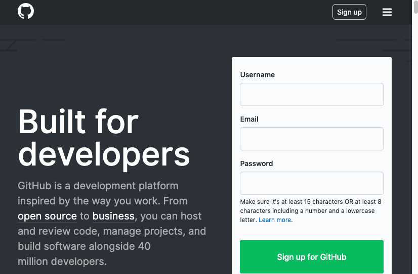
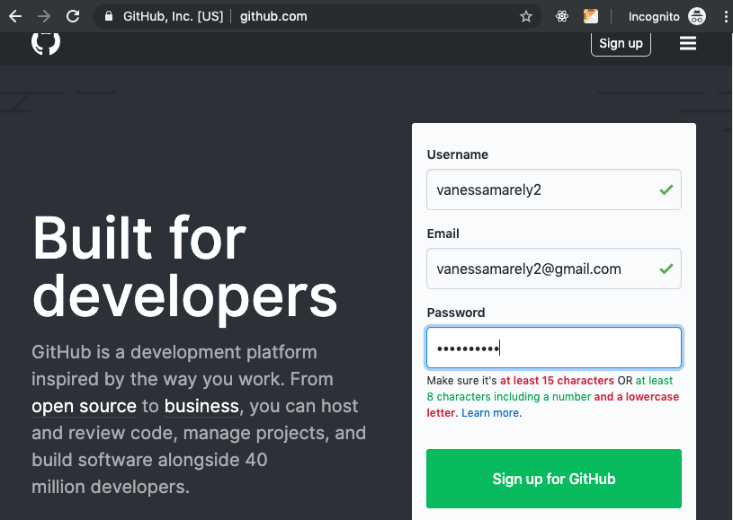
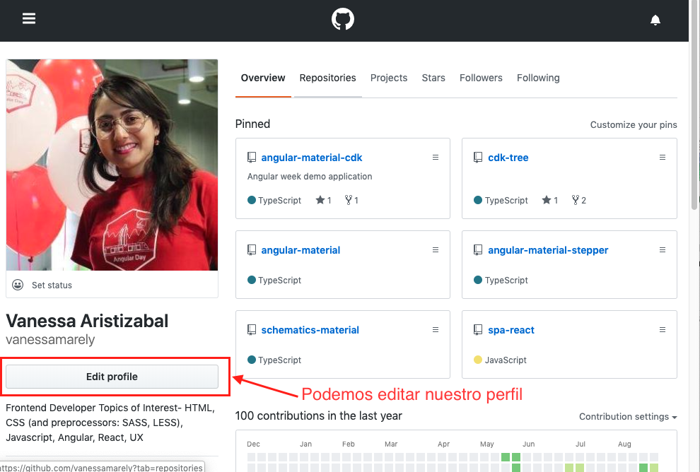
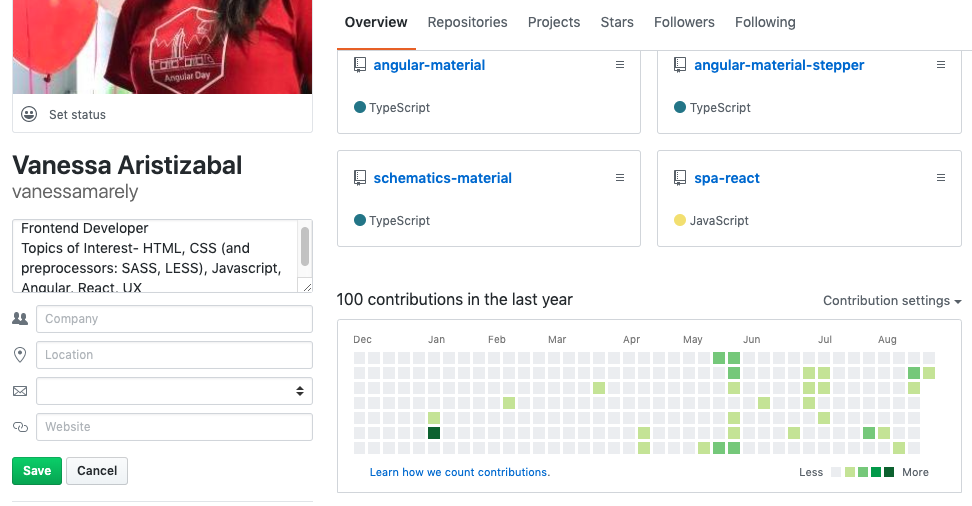
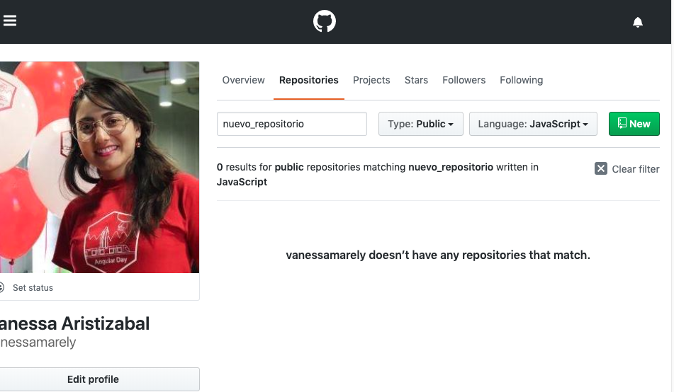
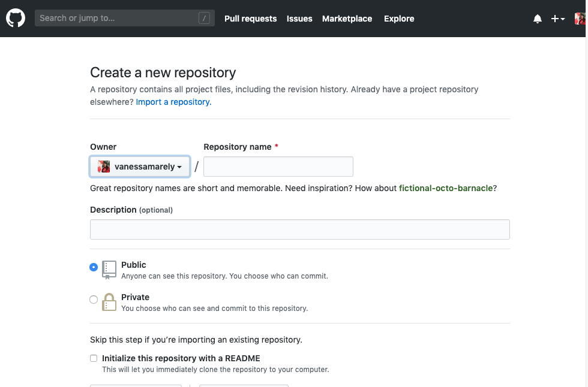
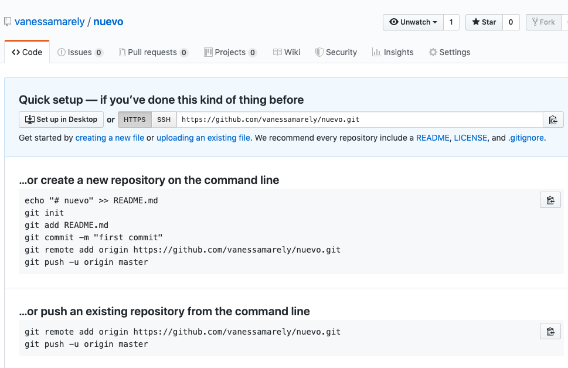

# 😺 GitHub 😺

## ¿Qué es GitHub?

GitHub es un sitio web y un servicio en la nube que ayuda a los desarrolladores a almacenar y administrar su código.

Permite llevar un registro y control de cualquier cambio en el código.&#x20;

Hay dos principios importantes que se deben conocer:&#x20;

* Control de Versión
* Git

### ¿Qué es Control de Versión?

Nos permite llevar un registro y control del código, permitiendo trabajar de forma segura en los proyectos.

### ¿Qué es Git?&#x20;

Git es un **sistema de control específico de versión distribuida**. El código y su historial se encuentran disponibles localmente en la computadora de todo desarrollador.

## **Como crear una cuenta en GitHub 📝**

Construir nuestra cuenta de GitHub es muy sencillo, vamos a seguir los siguientes pasos para crearla:

### **‌Paso 1**

**‌**En el navegador de preferencia vamos a colocar: **github.com**

### **Paso 2**

**‌**Vamos a llenar el siguiente formulario:

Al diligenciar el formulario damos clic en el botón "Sign up for gitHub" y confirmamos el correo que recibimos.

**‌**Una vez confirmada nuestra cuenta, podemos ir a nuestro espacio de GitHub y empezar a crear nuestros repositorios y visitar los que ya tenemos creados. Además de personalizarlo editando nuestro perfil.

## **Editar el perfil 🎈**

**‌**Podemos editar nuestro perfil dando clic en el botón "Edit profile".

Editamos el texto del perfil y podemos colocar nuestra ubicación, correo y página personal y guardamos.\
****

## **Crear un repositorio ✍️**

**‌**Para crear un nuevo repositorio se debe seleccionar la pestaña de "**Repositories**" y damos clic en el botón "**New**".

Al seleccionar el botón "**New**" nos aparecerá una página donde vamos a colocar el nombre del repositorio y vamos a dar clic en el botón "**Create repository**"\

Al seleccionar el botón nos quedará una página con la siguiente información que podemos usar para subir a GitHub un proyecto existente en ese repositorio o ir creando nuestros archivos e ir subiendolos a este repositorio.\

## Recursos

Te recomiendo los siguientes links que pueden ser de mucha utilidad para aprender más de GitHub:

* [https://guides.github.com/activities/hello-world/](https://guides.github.com/activities/hello-world/)
* [https://learngitbranching.js.org/](https://learngitbranching.js.org)
* [https://try.github.io/](https://try.github.io)
* [https://github.com/git-game/git-game](https://github.com/git-game/git-game)
* [https://github.com/Gazler/githug](https://github.com/Gazler/githug)
* [http://ningbit.github.io/blog/2013/06/12/8-bit-git-the-challenges-of-creating-a-git-based-game/](http://ningbit.github.io/blog/2013/06/12/8-bit-git-the-challenges-of-creating-a-git-based-game/)
* [https://datagoodie.com/blog/git-simple-tutorial-explanation-LEVEL-0/](https://datagoodie.com/blog/git-simple-tutorial-explanation-LEVEL-0/)
