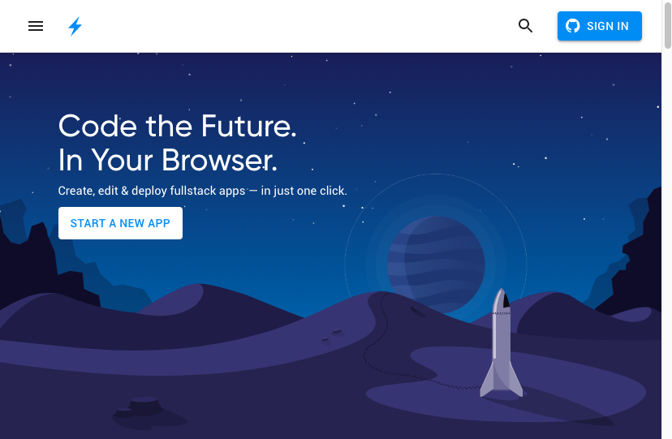
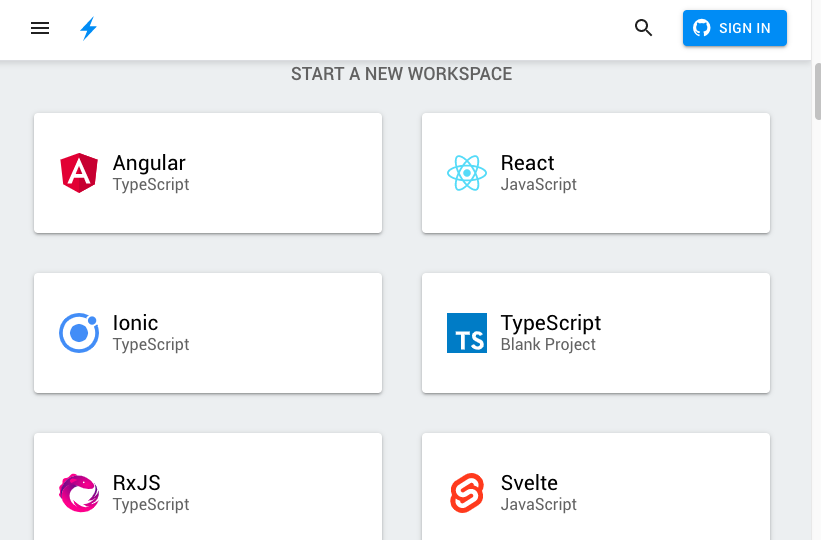
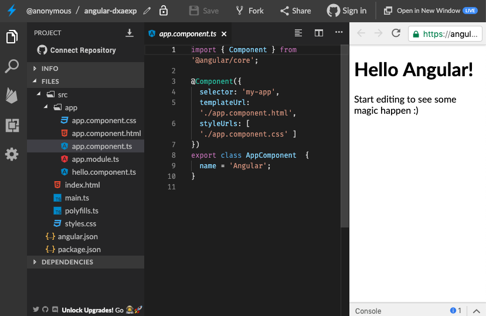

# ⚡ Stackblitz ⚡

****[**Stackblitz**](https://stackblitz.com) es un IDE en la nube que te permite crear aplicaciones Web. Eso quiere decir que ¡no tienes que instalar nada para crear tu aplicación! 😎


¿Qué es un IDE? es un entorno de desarrollo, es un entorno de programación que ha sido empaquetado, consiste de un editor de código, un compilador, un depurador y un constructor de interfaz gráfica (GUI)


**‌**Vamos a seguir los siguientes pasos para crear nuestra primera App en stackblitz:

### **Paso 1**

**‌**En el navegador de tu preferencia vamos a digitar: stackblitz.com

### **‌Paso 2**

Podemos crear una nueva App al darle clic en el botón: "START A NEW APP" y podemos crear un espacio de trabajo en varias tecnologías:

### **Paso 3**

Crearemos nuestra primera App en Angular, seleccionando la opción de Angular y así creamos nuestro "Hello Angular"

\
