# 🧔🏻 Interpolación \{{\}} 🧔🏻

## ¿Qué es la interpolación?

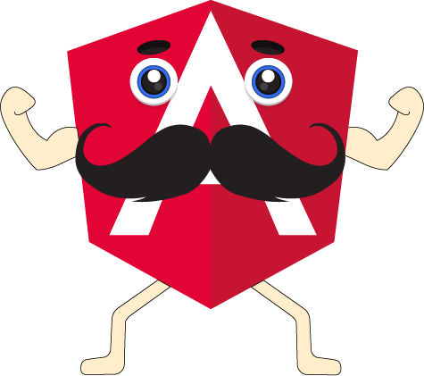

La interpolación es su definición más básica nos permite obtener la información  definida en la lógica y mostrarla en el HTML.

En Interpolación se utiliza la sintaxis `{{ valor }}`

```markup
<h3>2 + 2 es igual a {{2 + 2}}</h3>
```


&#x20;se usan las dobles llaves \{{\}}, que visualmente se parece a un mostacho o bigote.


A la interpolación, se le conoce como interpolación de cadenas, también conocida en inglés como "string interpolation".

A su sintaxis se le conoce como "moustache syntax" o sintaxis de bigote

Lo que se coloca entre las dobles llaves son llamadas expresiones. Podemos crear expresiones simples y complejas.

Cualquier expresión al final de cuentas se convertirá en una cadena y eso es lo que se colocará en la vista del componente.

Podemos ver expresiones con operaciones matemáticas.

```
{{ 2 + 2 }}
```

Expresiones con operadores lógico de negación:

```
{{ !valor }}
```

Expresiones que son devueltas en un método de componente. Lo que devuelva ese método es lo que se colocará en el template.

```
{{ metodoComponente() }}
```

## Reto Básico

Vamos a crear una mini galería dónde usaremos el concepto de interpolación.&#x20;

Para nuestra App vamos a seguir los siguientes pasos:

### Paso 1

Crearemos nuestro "**Hello Angular**", usando un IDE online como **Stackblitz**, podemos ver la guía de **Stackblitz** en la sección de "Guías útiles" .

Vamos a la página de **stackblitz.com** y creamos nuestra App de Angular.

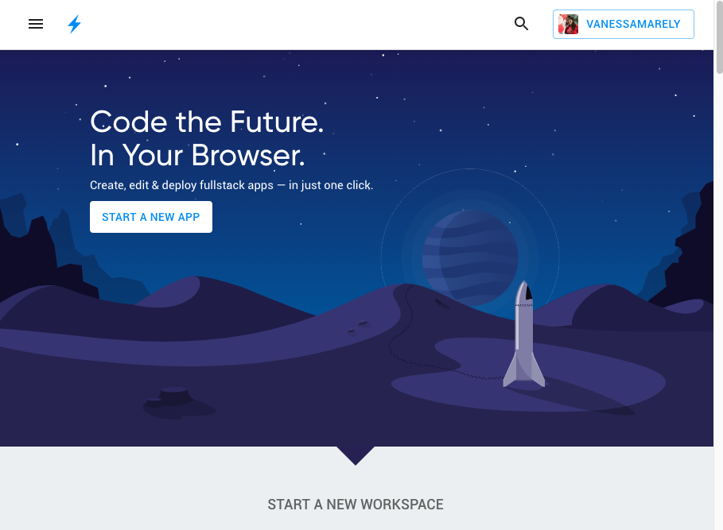

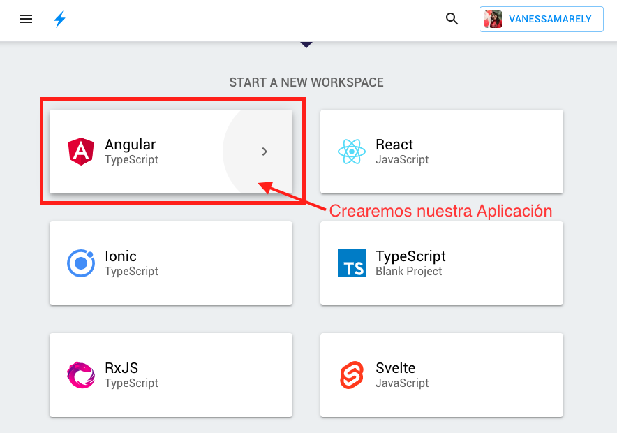

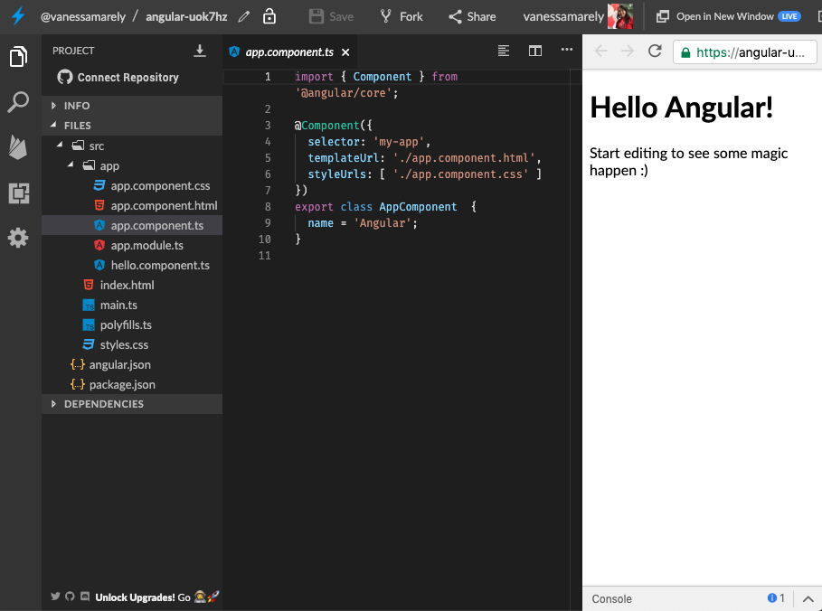

### Paso 2

Vamos a ir al archivo "**app.component.html**", seleccionamos el contenido y lo borramos.

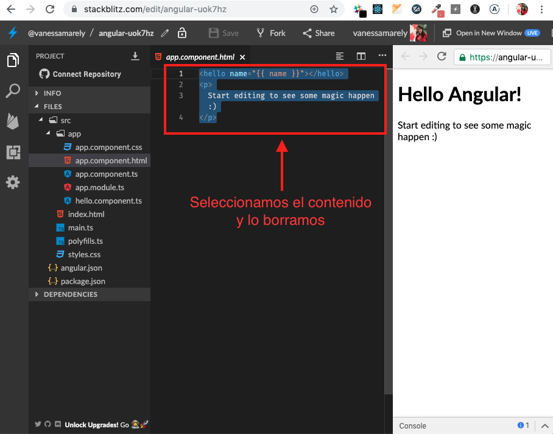

### Paso 3

En el archivo **app.component.html** vamos a colocar unas etiquetas para los títulos y una para una imagen.&#x20;

Vamos a incluir en nuestra imagen la siguiente url de un gif animado: [https://cdn2.thecatapi.com/images/49f.gif](https://cdn2.thecatapi.com/images/49f.gif)


Nos queda nuestro archivo con el siguiente código:


```
<h1>Interpolación</h1>
<h2>Reto básico</h2>

```


### Paso 4

Hemos añadido nuestra imagen, pero la idea es crear una mini galería con varias imágenes. Podemos duplicar la etiqueta de la imagen y tendríamos algo como esto:

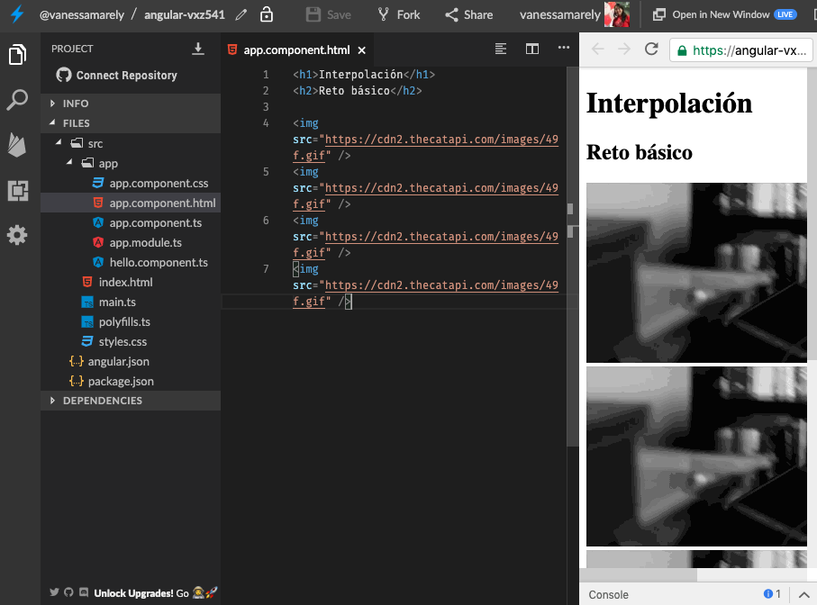

Usaremos la interpolación para la url de la imagen, entonces solo dejaremos una etiqueta de imagen y crearemos una variable en el archivo **app.component.ts**, llamada **img** donde pondremos la ruta de la imagen.


No modifiques nada más del contenido de **app.component.ts**, la sintaxis que ves en ese archivo es la básica de Angular.


Nos quedará un código como el siguiente:


```typescript
import { Component } from '@angular/core';

@Component({
  selector: 'my-app',
  templateUrl: './app.component.html',
  styleUrls: [ './app.component.css' ]
})
export class AppComponent  {
  name = 'Angular';
  img = 'https://cdn2.thecatapi.com/images/49f.gif';
}

```


Usaremos una API de gifs animados para tener más gifs animados en nuestra etiqueta **\**, colocaremos a nuestra variable **img** la url del API: [https://thecatapi.com/api/images/get?format=src\&type=gif](https://thecatapi.com/api/images/get?format=src\&type=gif?results\_per\_page=)

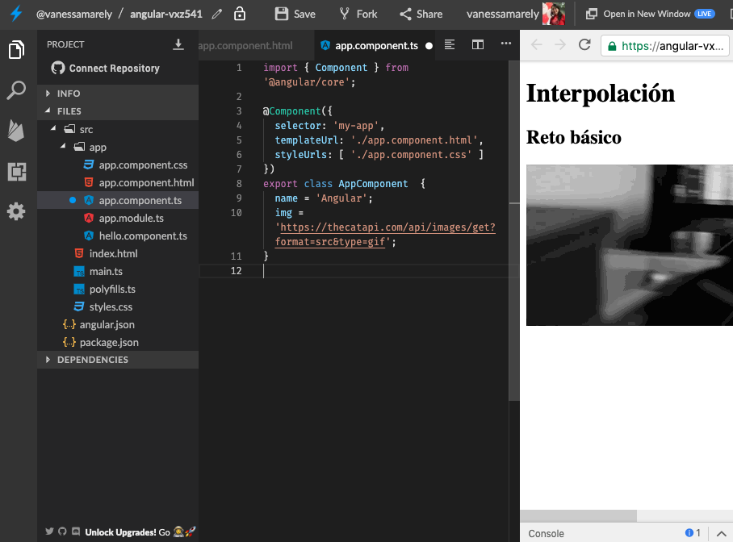

### Paso 5

Asignaremos en nuestra etiqueta **\** la url almacenada en nuestra variable.

Cambiaremos el texto de la variable **name** y pondremos en su lugar el texto Interpolación y lo incluiremos en uno de los títulos.


```markup
<h1>{{name}}</h1>
<h2>Reto básico</h2>


```


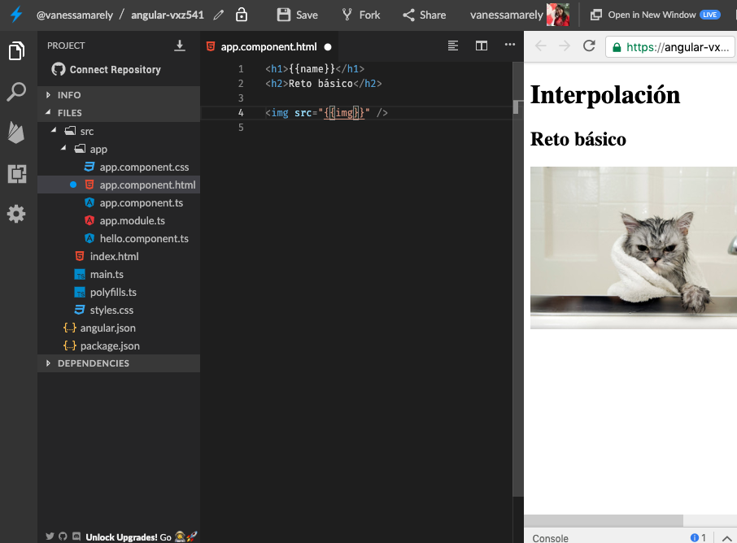

Duplicamos la etiqueta \ 6 veces para tener nuestra galería

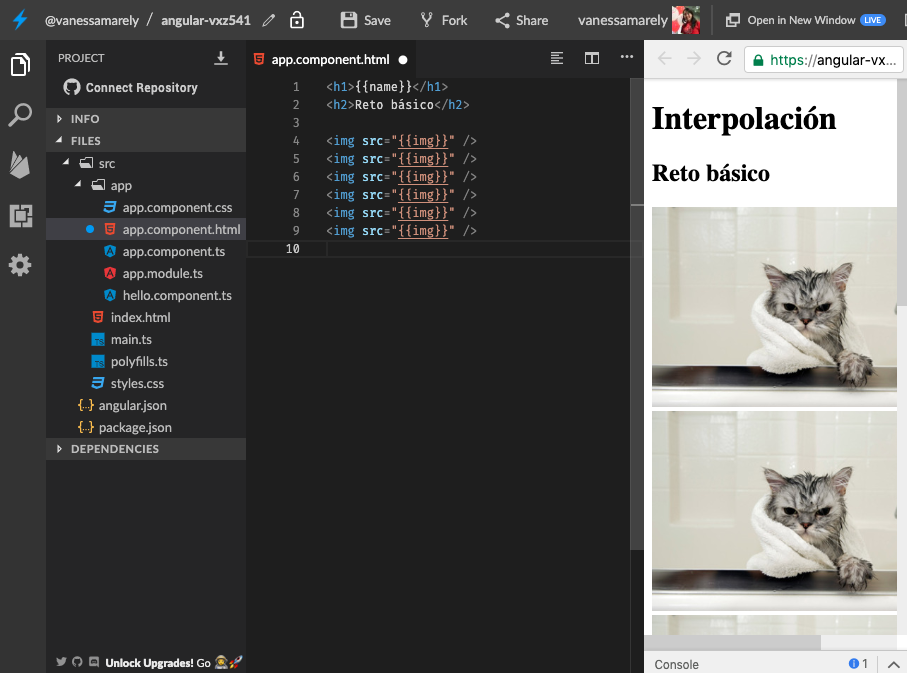

### Paso 6

Ahora tenemos una galería con la imagen repetida, podemos tener diferentes imágenes añadiendo en nuestra variable **img** "?results\_per\_page=", esta modificación la hacemos en nuestro **app.component.ts**


```typescript
import { Component } from '@angular/core';

@Component({
  selector: 'my-app',
  templateUrl: './app.component.html',
  styleUrls: [ './app.component.css' ]
})
export class AppComponent  {
  name = 'Interpolación';
  img = 'https://thecatapi.com/api/images/get?format=src&type=gif?results_per_page=';
}
```


En nuestro HTML a la variable **img** le podemos concatenar un número para que la imagen de nuestro gato cambie.


```markup
<h1>{{name}}</h1>
<h2>Reto básico</h2>


```


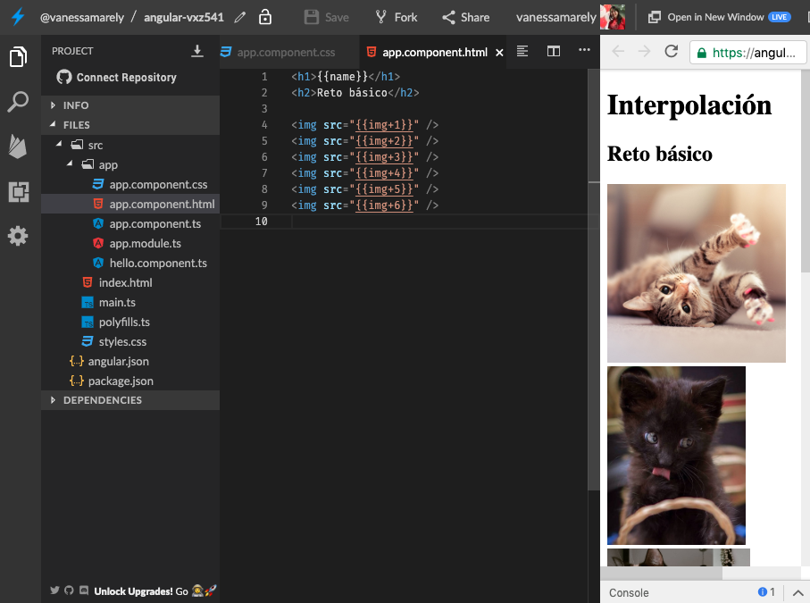

Podemos cambiar el css de las imágenes para poder ver nuestras imágenes con el mismo alto.

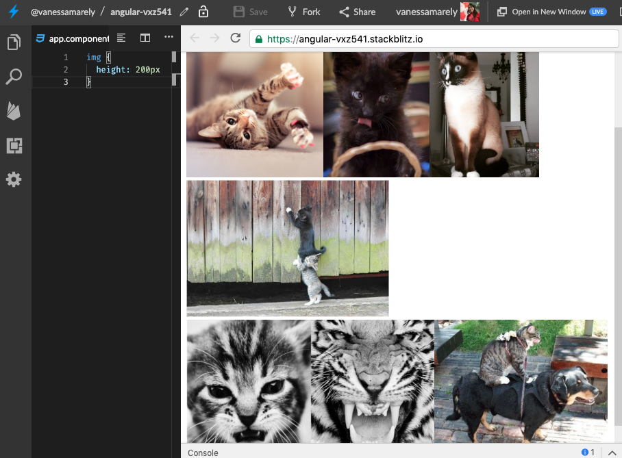

Podemos editar más el CSS para hacer nuestra galería mucho más bonita, pero esto te queda de tarea.&#x20;

Podemos usar más conceptos de Angular como las directivas para evitar duplicar las etiquetas \, pero esto lo veremos en el próximo articulo.&#x20;

## Demo!!!&#x20;

Puedes ver el ejercicio completo en la siguiente:



